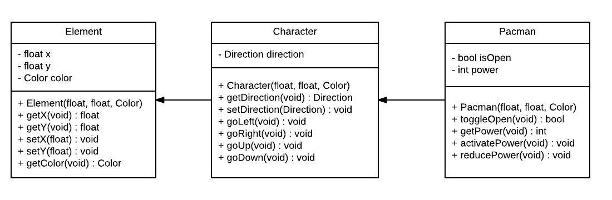

# Pacman game by C++ with SFML library
> My C++ Assignment in the second term of  IT course at AIT  
> Check out my Javascript version: [iamstevendao/pacman](https://github.com/iamstevendao/pacman)  

[](https://twitter.com/iamstevendao) [](https://www.linkedin.com/in/steven-dao-b9a065127/) [](https://www.sfml-dev.org/documentation/2.3.2/)
[](https://www.sfml-dev.org/license.php)

### Update on 2017-09-28: With Dijkstra's Algorithm, ghosts chase Pacman and among cherries by different shortest paths.

## Table of Contents
- **[Requirement](#requirement)**  
- **[In-Game Screenshots](#in-game-screenshots)**  
- **[Usage](#usage)**  
- **[Main Classes](#main-classes)**  
- **[License](#license)**

## Requirement
- C++ 10 (Visual C++ 2010)
- With C++ 10+ (Need to retarget and update project by [Visual Studio](https://www.visualstudio.com/))

## In-Game Screenshots


## Usage
- Build and run with Visual C++ 2010 (Demo incluced)  
*Debug mode will not work as expected because of iterations problem in the Visual Studio 2010 ([references](https://msdn.microsoft.com/en-us/library/aa985982.aspx))*
- Easy changable game properties (in **Constant.h**):
  ```
  #pragma region Number
  #define NUMBER_GHOST 8
  #define NUMBER_GHOST_COLOR 5
  #define NUMBER_INTERVAL 80
  #define NUMBER_POWER 50
  #define NUMBER_CHERRY 5
  #pragma endregion
  ```

## Main Classes



## License
This project is opensource, constribution and feed back are highly welcome.

This project is distributed under [sfml's license](https://www.sfml-dev.org/license.php)
