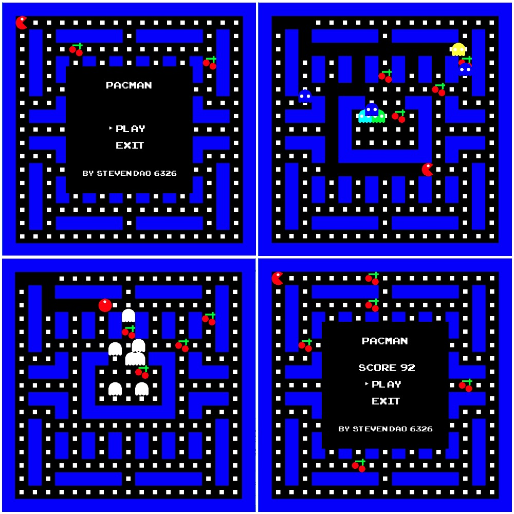

# Pacman game by C++ with SFML library
> My C++ Assignment in the second term of  IT course at AIT, check out my Javascript version: [](https://github.com/iamstevendao/pacman)  

[](https://www.sfml-dev.org/documentation/2.3.2/)
[](https://www.sfml-dev.org/license.php)

## Table of Contents
- **[Requirement](#requirement)**  
- **[In-Game Screenshots](#in-game-screenshots)**  
- **[Usage](#usage)**  
- **[Main Classes](#main-classes)**  
- **[License](#license)**

## Requirement
- C++ 10 (Visual C++ 2010)

## In-Game Screenshots


## Usage
- Build and run with Visual C++ 2010 (Demo incluced)
- Easy changable game properties (in **Constant.h**):
  ```
  #pragma region Number`
  #define NUMBER_GHOST 8
  #define NUMBER_GHOST_COLOR 5
  #define NUMBER_INTERVAL 80
  #define NUMBER_POWER 50
  #define NUMBER_CHERRY 5
  #pragma endregion
  ```

## Main Classes


## License
This project is distributed under [](https://www.sfml-dev.org/license.php)
